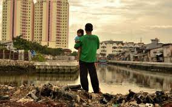

# Capstone Proposal
## Indonesia Poverty and Equity Program (P181107)
### Proposed by: William Seitz
#### Email: wseitz@worldbank.org
#### Advisor: Edwin Lo
#### The George Washington University, Washington DC  
#### Data Science Program

## 1 Objective:  
 
            For our project, we plan to explore Indonesia's development and connectivity by analyzing a variety of data sources, 
            including AIS (which captures data from ships), household surveys, and census information. Our collective goal is to 
            uncover the principal patterns, challenges, and opportunities for growth within Indonesia, with a particular emphasis on 
            aspects that affect people's quality of life and economic fairness. We aim to develop practical strategies and policy 
            recommendations that will enhance connections across Indonesia's diverse regions, promoting equitable growth. Our 
            analysis seeks to contribute to a better understanding of how strengthening connections can aid in poverty reduction and 
            support equitable development. Ultimately, this project is about improving the living standards and expanding 
            opportunities for the people of Indonesia.
            

## 2 Dataset:  

            William Hutchins Seitz has given us a lot of data about Indonesia. This data covers many areas, like people's health, 
            education, and how much money they make, from small villages (desa) to big areas (kabupaten). It's from the PODES surveys 
            and includes information from 2011 to 2019.
            
            This data helps us see how Indonesia is changing, especially in health, schools, and how people live. We can use it to 
            really understand the different parts of Indonesia, find out what the big problems are, and think of ways to make things
            better for everyone. It's really important for making good plans, helping places that need it, and learning more about 
            how to improve people's lives in Indonesia.
            

## 3 Rationale:  

            Our goal with the Indonesia EAP Project is to make life better for people by using the data we have. We want to find and 
            fix the differences in health, education, and how people are living in different parts of Indonesia. We're trying to make 
            things fairer and improve how everyone lives. This way, we hope to see development that is equal and includes everyone.
            
            

## 4 Approach:  

            To effectively execute our capstone project, we will proceed with the following steps:

            1. We'll start by thoroughly examining the data, including the detailed village-level and healthcare information from the
            PODES surveys. Our focus will be on cleaning and organizing this data for analysis.

            2. Next, we'll integrate various datasets to form a unified picture, focusing on aspects like living conditions and 
            expenditure patterns in Indonesia.

            3. We will enhance our analysis by incorporating satellite data with the survey data, using statistical methods to draw 
            meaningful insights.

            4. Our team will develop maps and visual graphics to clearly present our findings, making the complex data more 
            accessible and understandable and also create statistical models to find out significance our results.

            5. We will perform a rigorous validation process to ensure the accuracy and reliability of our results.

            6. Additionally, we plan to identify and analyze regional disparities in healthcare and education, using the data to 
            pinpoint areas that require focused interventions.

            7. Finally, we aim to formulate actionable recommendations based on our findings, proposing strategies that can 
            contribute to equitable development and improved welfare outcomes in Indonesia.

            

## 5 Timeline:  

            Here's our rough timeline to finish the project within 12 weeks:

            - (2 Week) Preparing and Cleaning Data.
            - (1 Week) Merging Various Datasets.
            - (1 Week) Working with Satellite and GIS Data.
            - (1 Week) Combining Survey and Satellite Information.
            - (2 Weeks) Developing Statistical Models.
            - (2 Weeks) Creating Visuals and Maps.
            - (1 Week) Checking and Validating Results.
            - (1 Week) Drafting and Submitting the Report.
            - (1 Week) Preparing for the Final Presentation.
            

## 6 Expected Number Students:  

            two 
            

## 7 Possible Issues:  

           The Challenge that we think we would face is from handeling the data, and its dimensionality, PODES survey covers large 
           number of variables giving us an average of 150 features in each data file with more than 15 files to handle, and 
           understanding the data is going to be the biggest challenge for us.
            

## Contact
- Author: Edwin Lo
- Email: [edwinlo@email.gwu.edu](Eamil)
- GitHub: [https://github.com/pranavsai-98/GW-Capstone-Indonesia-Poverty-and-Equity-Program](Git Hub rep)
